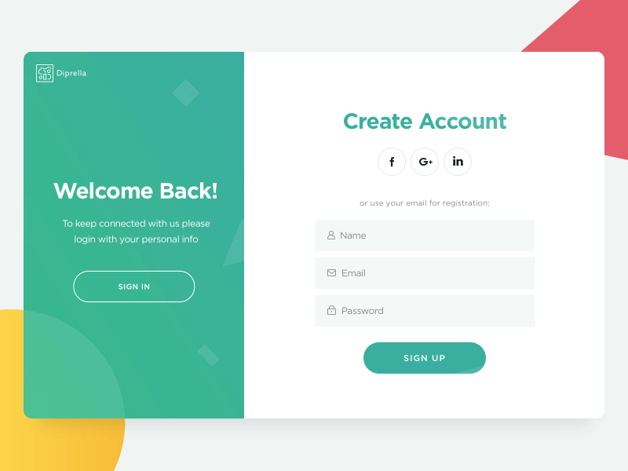

<h1>Projet d'informatique ISEN fin de 3ème année</h1>

<header>

<li><a href="#IDEE"> Idée du projet </a></li>
<li><a href="#GESTION"> Gestion du projet </a></li>
<li><a href="#SCRUM"> Utilisation du Scrum </a></li>
<li><a href="#STRUCTURE"> Structure du projet  </a></li>
<li><a href="#INSPIRATION"> Inspiration pour la projet  </a></li>
<li><a href="#LANGAGES"> Langage de programmation  </a></li>
<li><a href="#FONCTIONNALITES"> Fonctionnalités  </a></li>
</header>

<h2>Idée du projet</h2>

<li>Interface web (html), une fois connecté envoie automatiquement (tous les dimanches) un mail avec l'emploi du temps de la semaine au format .ics et les nouvelles notes.</li>
 
<li>Alimente la base de donnée avec l'identifiant, le mot de passe, l'email, le planning et les notes.</li>
 
<li>Checking des informations tous les jours pour voir s'il y a des changements. (attention s'il y a trop d'inscrits cela pourrait surcharger le serveur Aurion)</li>
 
<li>Créer un assistant vocal qui sera disponible sur la page web pour permettre de poser des questions concernant par exemple le nombre d'heures de cette semaine ou calculer la moyenne génerale</li>

<h2>Gestion de projet</h2>

Nous avons créé un projet sur github avec une liste des différentes tâches classées selon leur état d'avancement :

<li><a href ='https://github.com/hugodemenez/Projet_2021_Informatique/projects/1'>Suivre l'état d'avancement du projet</a></li>
 

Nous nous sommes entendus pour avoir une répartition équitable des tâches :

<h2>Utilisation du Scrum</h2>

<h2>Structure du projet</h2>

<h2>Inspiration pour le projet</h2>

<h2>Langage de programmation</h2>

    <ul>
        <li>Python :
        WebAurion ne possède pas d'API, nous utilisons donc la méthode du web-scraping au travers d'un headless web-browser pour récupérer les données comme :
            <ul>
                <li>Verification des données d'indentification </li>
                <li>Les notes </li>
                <li>Le planning </li>
            </ul>
        </li>
        
         
        <li>PHP :
        Réaliser une interface web pour utiliser l'application :
            <ul>
                <li> Consultation des données sous forme de graphique</li>
                <li> Instription pour recevoir l'emploi du temps toutes les semaines</li>
            </ul>
        </li>
    </ul>

<h2>Les fonctionnalités présentes</h2>
<li>ChatBot</li>

Nous avons eu l'idée d'ajouter un chatbot afin que l'utilisateur puisse profiter d'une nouvelle expérience et cela permet d'obtenir d'autres services.
Notre chatbot pourra par exemple afficher le planning de la semaine, le planning du jour, la moyenne, la dernière note obtenue, etc ...
L'utilsateur n'aura qu'à ouvrir la chatbox en cliquant sur l'icone en bas à droite puis le bot posera une question et l'utilisateur choisira sa réponse en cliquant dessus.

 

